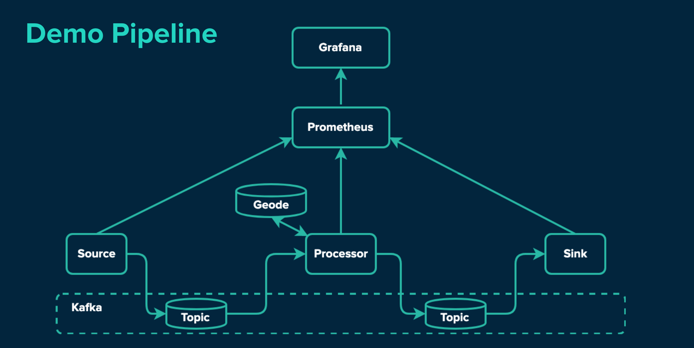

# Demo Pipeline using Geode, Kafka, and Spring Cloud Stream
This repo showcases how Geode can be used in a simple streaming data pipeline. The source and sink apps are Spring Cloud Stream apps, and the processor is a simple Spring Boot app that enriches the data flowing through the pipeline with values pulled from a lookup against Geode. 




# Setup
In this demo we will set up a local cluster with minikube and deploy a pipeline that grabs from a file source and enriches the payload with data from geode. We use micrometer to grab throughput and count metrics.

## Dependencies
You will need the following installed on your local workstation:

#### Docker
For [mac installations](https://docs.docker.com/docker-for-mac/install/).

#### Kubernetes & Minikube
On macs: 

```bash
$ brew install kubernetes-cli
$ brew cask install minikube
```

> Note that you will need to have a hypervisor installed; if you don't, check out the kubernetes guide to [installing a hypervisor](https://kubernetes.io/docs/tasks/tools/install-minikube/#install-a-hypervisor).

#### k9s for easy Kubernetes exploration (optional)
https://github.com/derailed/k9s

## How to Spin up the Pipeline Locally

### 1. Start minikube


```
$ minikube start --cpus 4 --memory 8096 --vm-driver=hyperkit
```


 Explore the k8s cluster with:
 
 ```
 $ k9s
 ```
 
> Note that selecting a container in k9s and pressing `s` will ssh you into that container. `l` will display logs.

### 2. Deploy kafka, geode, pipeline apps, prometheus and grafana

```
$ cd k8s
$ kubectl apply -f geode
$ kubectl apply -f kafka
$ kubectl apply -f prometheus
$ kubectl apply -f grafana
$ kubectl apply -f geode-stream.yml
```

After each step, confirm that the container is deployed. This may take a while as each container needs to be downloaded.

Congratulations! Your infrastructure should now be up and running in Kubernetes. Now let's populate Geode with some lookup data...

### 3. Create and Populate the Geode nodes
##### Copy over the database snapshot

```bash
$ kubectl cp geode/data/1mil.gfd server-0:/tmp/1mil.gfd
```

##### ssh into locator-0
If you're using k9s, select the locator and press `s`.
If you are not using k9s, run the following command: `$ kubectl exec -ti {locator-0-pod-name} bash`. (Replace the value surrounded with curly braces with the actual name of your locator pod).

##### Run the gemfire shell
```bash
$ gfsh
```

##### Connect to the locator and create the region

```bash
gfsh > connect --locator=locator-0[10334] --jmx-manager=locator-0[1099]
gfsh > create region --name=telemetryRegion --type=REPLICATE
```

##### Import data
```bash
gfsh > import data --region=telemetryRegion --file=/tmp/1mil.gfd --member=server-0
```
> Note that the file has to be on the member you're pointing to; in this case, /tmp/1mil.gfd is on geode-server-0

##### Query the region to confirm import success

```bash
gfsh > query --query='select count(*) from /telemetryRegion'
```


### 5. Open up Grafana for metrics visualization

##### Port forward grafana

```bash
$ kubectl port-forward {grafana-pod-name} 3000
```

##### Open grafana at `http://localhost:3000/login`
Use these credentials:

```bash
user:       admin
password:   password
```

##### Import sample dashboard
Look for an "Import" option on the menu. For a quickstart, import our sample json dashboard, which you can find under the `/k8s/grafana/dashboards/` path.


### 6. Begin streaming data through the pipeline
The file source app is a spring cloud stream app that:

- looks for files in the `/tmp` folder
- reads files dropped into `/tmp` line by line
- publish each line into a kafka topic

We will copy a file that contains 1 million sample telemetry records into the file source app. The file source app will begin streaming these records into a Kafka topic, which will then be consumed by our geode processor application, enriched with data stored in geode, and then published to another kafka topic. You should begin seeing total count and throughput in grafana as the data streams through the pipeline. 

##### Copy telemetry data into the file source app

```bash
$ kubectl cp geode/data/1mil_telemetry.txt {file-source-pod-name}:/tmp/foo/1.txt
```

You can also view the data going through the processor and sink by watching the logs. 

## Scale it out in the Cloud!
Since the pipeline runs on Kubernetes, you can try it in your preferred cloud provider. Try scaling the geode locators and servers and see how that affects your throughput. Have fun with it!

## Tear Down

```
$ kubectl delete deployment --all
$ kubectl delete statefulset --all
```

To tear down minikube:

```
$ minikube delete

```
